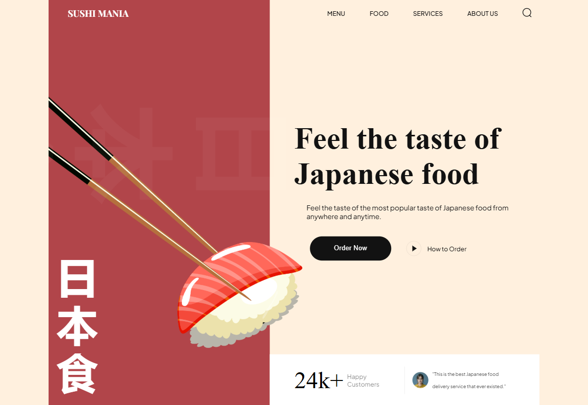

# Sushi Mania  
**Click to visit [live site](https://sushi-mania-delta.vercel.app/) _(Vercel)_**

## Introduction
_I made this website following this youtube [tutorial](https://www.youtube.com/watch?v=QRrPE9aj3wI)._

I made this simple site to learn the fundamentals of html & css.  
This project helped me in learning the relationship between **html, css & javascript**.  
I also learned to use basic animations and to make the site more responsive.  

## Features
_This simple frontend project is responsive and uses smooth & subtle animations to enhance the overall user experience. This site contains :_  
* Navigation Bar  
* Hero Section  
* About Us Section  
* Popular Food, Trending Sushi, and Drinks Sections  
* Newsletter, Signup and Footer  

## Project Preview
  

## How to run this project locally  
Make sure you have the following installed on your machine:  
* Git  
* Node.js  
* npm  

**Cloning the repositary**  
```
git clone https://github.com/impriyanshusah/sushi-mania.git
```  

**Installation**  
```
npm install
```

**Running the project**
```
npm run dev
```